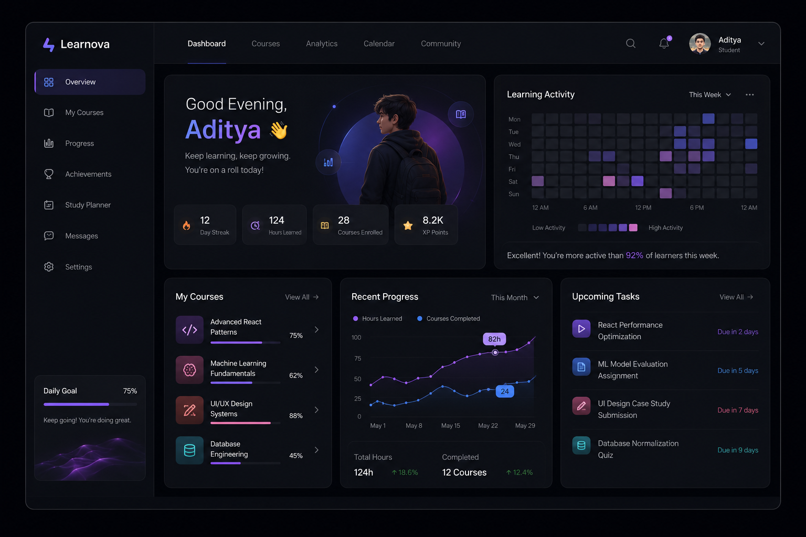

# 🚀 Next-Gen Learning Dashboard

A **premium futuristic learning analytics dashboard** built using **Next.js 15, TypeScript, Tailwind CSS, Framer Motion, and Supabase**.

Designed as a **high-fidelity educational SaaS dashboard** featuring responsive layouts, smooth animations, dynamic course data, and modern analytics visualization.

---

## ✨ Features

* Premium dark-mode dashboard UI
* Responsive sidebar navigation
* Hero learning analytics section
* Dynamic course cards from Supabase
* Animated progress indicators
* Activity / analytics visualization
* Framer Motion micro-interactions
* Loading skeleton states
* Error boundary handling
* Fully responsive design
* Server Component data fetching

---

## 🛠 Tech Stack

### Frontend

* Next.js 15 (App Router)
* TypeScript
* Tailwind CSS
* Framer Motion

### Backend / Database

* Supabase
* PostgreSQL
* @supabase/supabase-js
* @supabase/ssr

### UI & Visualization

* Lucide React
* Recharts
* Geist Font

### Deployment

* Vercel

---

📸 Preview
Dashboard UI



## 📁 Project Structure

```txt
app/
├── layout.tsx
├── page.tsx
├── loading.tsx
└── error.tsx

components/
├── Navbar.tsx
├── Sidebar.tsx
├── HeroPanel.tsx
├── CourseCard.tsx
├── ActivityChart.tsx
├── ProgressAnalytics.tsx
└── UpcomingTasks.tsx

lib/
└── supabase.ts

types/
└── course.ts

public/
├── design-reference.png
├── boy.png
└── goal-video.mp4
```

---

## ⚙️ Environment Variables

Create a `.env.local` file in the root directory.

```env
NEXT_PUBLIC_SUPABASE_URL=

NEXT_PUBLIC_SUPABASE_ANON_KEY=
```

---

## 🗄 Supabase Setup

Create a table named:

```sql
create table courses(
 id uuid primary key default gen_random_uuid(),
 title text not null,
 progress integer not null,
 icon_name text not null,
 created_at timestamp default now()
);
```

Seed sample data:

```sql
insert into courses
(title, progress, icon_name)

values
('Advanced React Patterns',75,'Code'),
('Machine Learning Fundamentals',62,'Brain'),
('UI UX Design Systems',88,'Palette'),
('Database Engineering',45,'Database');
```

---

## 📦 Installation

Clone the repository:

```bash
git clone YOUR_REPOSITORY_URL
```

Move into project:

```bash
cd next-gen-dashboard
```

Install dependencies:

```bash
npm install
```

Run development server:

```bash
npm run dev
```

Open:

```txt
http://localhost:3000
```

---

## 🎯 Implementation Highlights

* Server Components for secure data fetching
* Dynamic Supabase-powered dashboard
* Component-based architecture
* Zero layout-shift animation strategy
* Semantic HTML structure
* GPU-friendly Framer Motion animations
* Production-ready responsive design

---

## 🌐 Deployment

Deploy easily using **Vercel**.

```bash
npm run build
```

Production ready.

---
